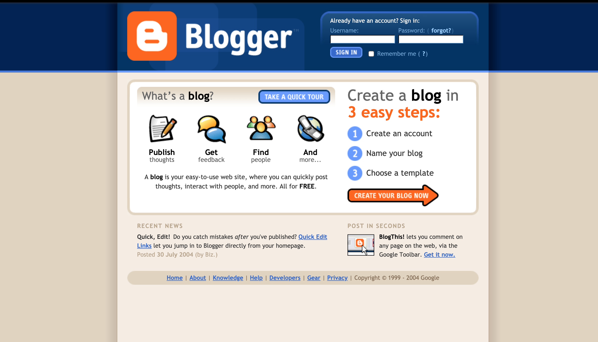
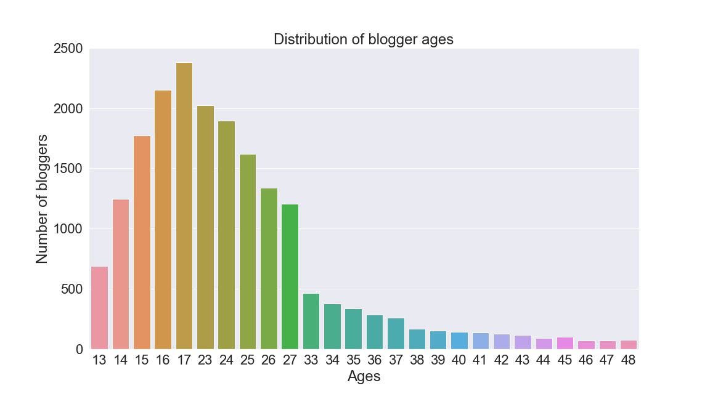
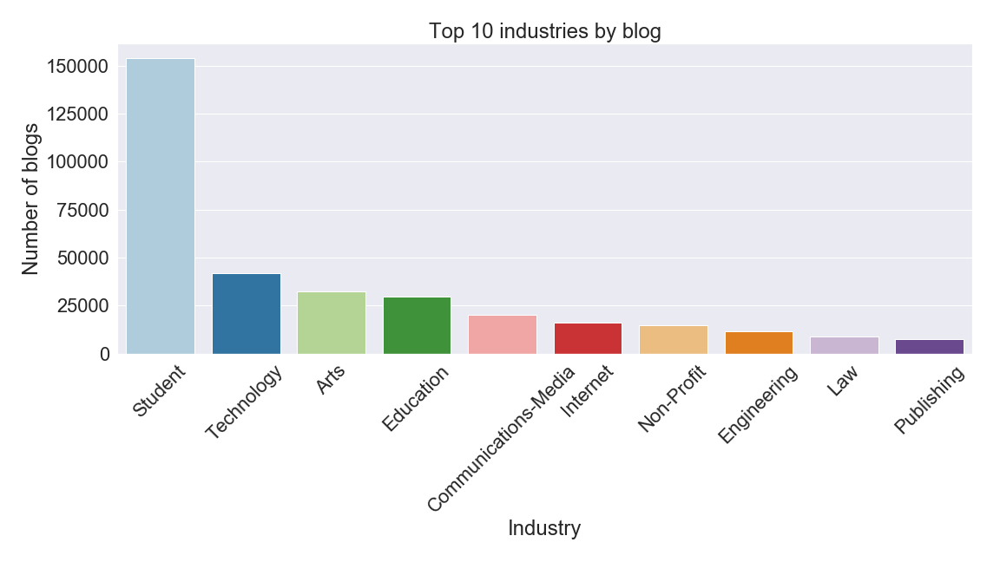
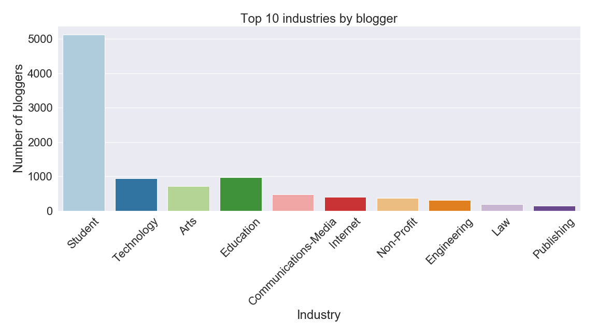
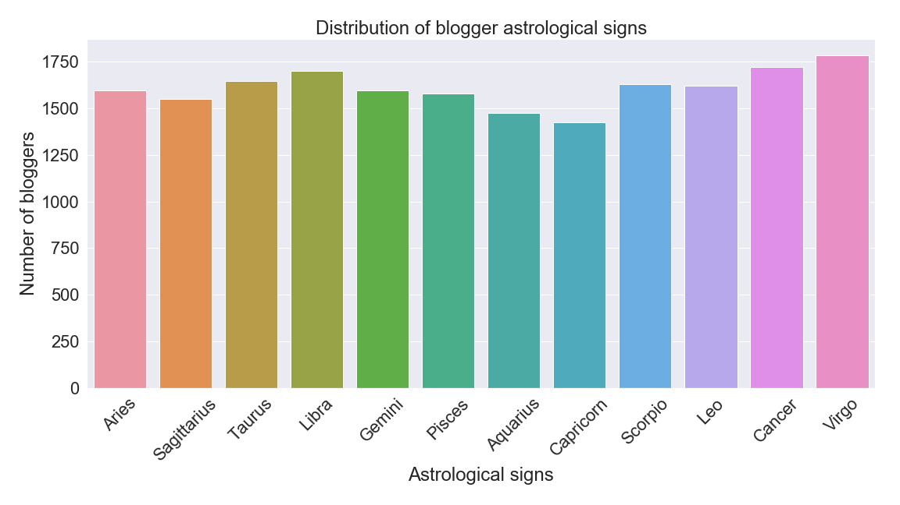
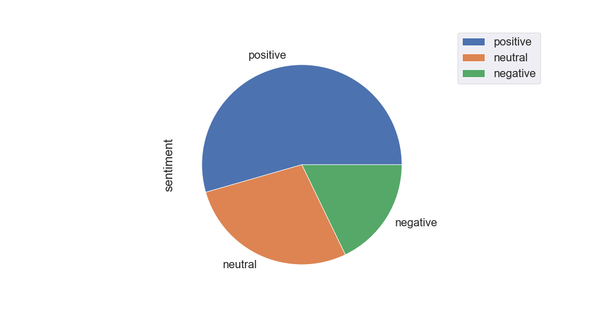
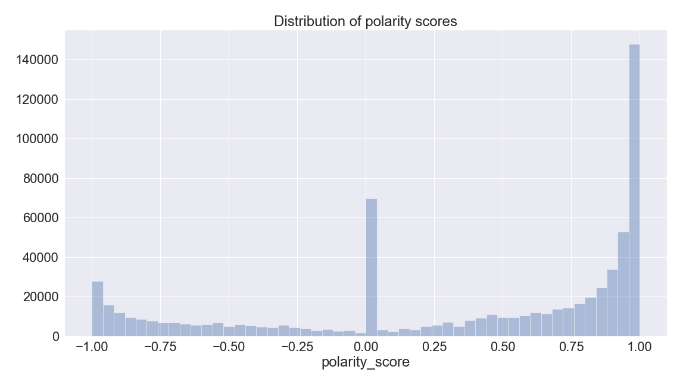
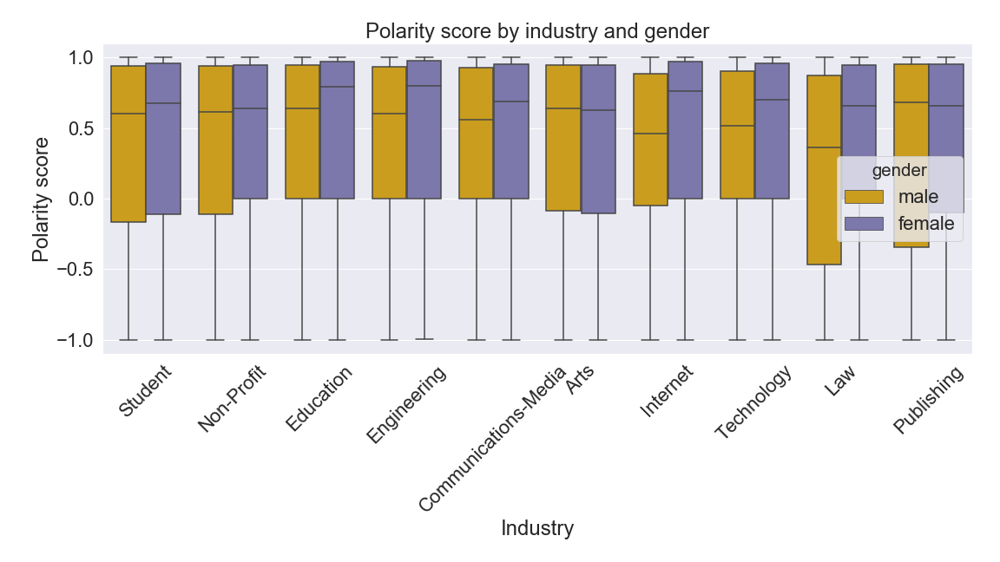
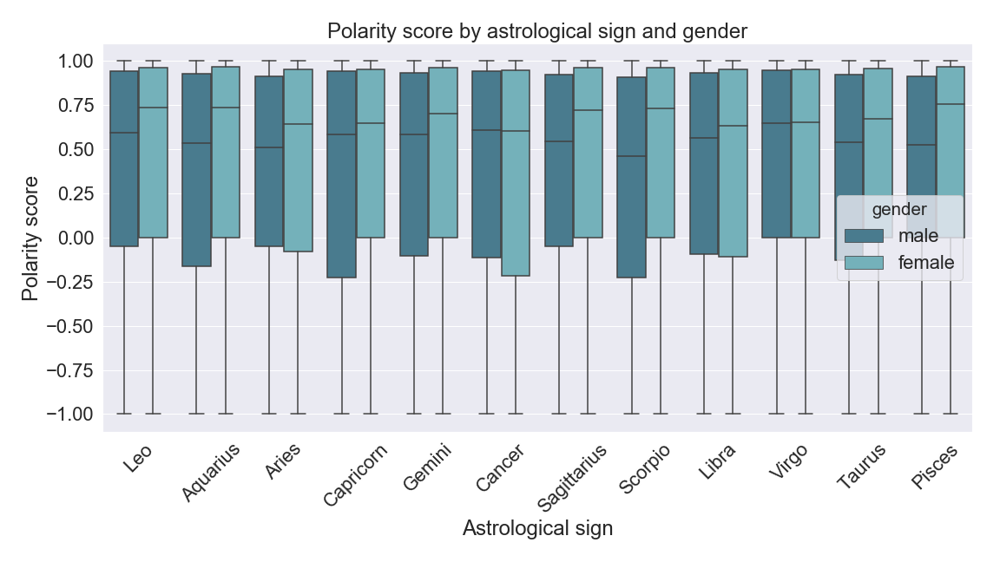

# Final report: Blog Sentiment Analysis
### **[Eva Bacas](https://github.com/vnbcs) | [LING 1340](https://naraehan.github.io/Data-Science-for-Linguists-2019/) | April 26, 2019**

### Table of Contents:
+ **[1. Project overview](#1-project-overview)**
  + [1.1 Introduction](#11-introduction)
  + [1.2 Process](#12-process)
  + [1.3 Setbacks and difficulties](#12-setbacks-and-difficulties)
+ **[2. Data](#2-data)**
  + [2.1 The Blog Authorship Corpus](#21-The-Blog-Authorship-Corpus)
  + [2.2 Reading and processing the data](#22-reading-and-processing-the-data)
  + [2.3 Overview of the corpus](#23-overview-of-the-corpus)
+ **[3. Analysis](#3-analysis)**
  + [3.1 Word frequency](#31-word-frequency)
  + [3.2 Topic modeling](#32-topic-modeling)
  + [3.3 Sentiment analysis](#33-sentiment-analysis)
+ **[4. Conclusions](#4-conclusions)**
  + [4.1 What I learned](#41-what-i-learned)
  + [4.2 If I could do it again...](#42-if-i-could-do-it-again)
+ **[5. Works Cited](#5-works-cited)**

## 1. Project overview

### 1.1 Introduction
In this project, I investigated different ways to extract linguistic information from a corpus. I started my project without clear goals in mind. I knew I wanted to explore analyses that I will hopefully use again in the future, as well as learn more about machine learning's linguistic applications. I narrowed my interests down into three big research questions:

+ What information can I get out of a text corpus?
+ How can I use machine learning to extract that information?
+ How can I show that information with data visualization?

I found an interesting corpus, [the Blog Authorship Corpus](http://u.cs.biu.ac.il/~koppel/BlogCorpus.htm)[^1], made up of Google Blogger blogs from 2004, and started exploring the data. In addition to the textual data, each blog contained demographic information related to the blogger, which provided a chance for me to explore the corpus through a sociolinguistic lens. Along the way, I developed more specific research questions to focus on for this project:

+ What are the most frequent words? How does word frequency vary between groups of bloggers?
+ What topics are found in these blogs?
+ What sentiments are found in these blogs? How does sentiment vary between groups of bloggers?

### 1.2 Process

I read the data in as a data frame, and there was minimal clean up needed (see [2.2 Reading and processing the data](#22-reading-and-processing-the-data) for more details). I began compiling basic stats and data visualizations to look at the blogger demographics. Unfortunately, I first did this [by blog](https://nbviewer.jupyter.org/github/Data-Science-for-Linguists-2019/Blog-Sentiment-Analysis/blob/master/progress_report1.ipynb#Basic-Stats) and not by blogger. Since the number of blogs per blogger varies wildly, this is not a great way to look at demographics. I redid my basic stats by blogger in my [second progress report](https://nbviewer.jupyter.org/github/Data-Science-for-Linguists-2019/Blog-Sentiment-Analysis/blob/master/progress_report_part2.ipynb#Overview).

Next, I began my analysis. I did [topic modeling](https://nbviewer.jupyter.org/github/Data-Science-for-Linguists-2019/Blog-Sentiment-Analysis/blob/master/progress_report_part2.ipynb#Data-analysis:-Topic-clustering) first, though word frequencies come first in the notebook. I found a pretty good tutorial using followed it almost exactly. I had some issues with word frequencies, which I will expand on in the following section. After that, I tried my hand at sentiment analysis. After consulting many different sentiment dictionaries, I decided to look for a pre-trained model since I just don't think I currently have the skill to create a sentiment model myself.

After investigating sentiment and mapping polarity scores to the dataset, I attempted to create a mixed effects model to see if any of the demographic information were predictors for the polarity score. All data visualizations pointed to absolutely not, but I tried anyway, and it wasn't significant. I won't go into it too much since I didn't really know what I was doing, but I'm leaving [the notebook](https://nbviewer.jupyter.org/github/Data-Science-for-Linguists-2019/Blog-Sentiment-Analysis/blob/master/progress_report_part3b.ipynb) in for reference.

### 1.3 Setbacks and difficulties

Luckily, I did not have many issues [reading in the data](#22-reading-and-processing-the-data). However, I had a couple big difficulties while I was analyzing the data. First, my dataset is really large, and it did not occur to me to use a smaller subset of the data. This meant basically every text-based process took forever. I wish I had tweaked my [topic model](https://nbviewer.jupyter.org/github/Data-Science-for-Linguists-2019/Blog-Sentiment-Analysis/blob/master/progress_report_part2.ipynb#Data-analysis:-Topic-clustering) a couple more times and gone back and tokenized with several different methods, but those processes just took so long. (Well, I actually did tokenize the whole dataset twice, but then I had another issue...)

When I was tokenizing the data for [the sentiment word frequency analysis](https://nbviewer.jupyter.org/github/Data-Science-for-Linguists-2019/Blog-Sentiment-Analysis/blob/master/progress_report_part3.ipynb#Running-VADER-on-10k-blog-sample), I added the tokens as a column to my data frame where each row is a list of tokens. When I saved the data frame as a CSV, the list was put within another list, making the individual tokens inaccessible (at least, I couldn't figure out how access them). See [here](https://nbviewer.jupyter.org/github/Data-Science-for-Linguists-2019/Blog-Sentiment-Analysis/blob/master/images/making_nice_graphs.ipynb#Word-frequencies) for examples of this issue. I put off further word frequency analysis since I thought it would be easy to come back to, but because of this issue, I was not able to do as much with word frequency as I wanted to.

## 2. Data

### 2.1 The Blog Authorship Corpus

[The Blog Authorship Corpus](http://u.cs.biu.ac.il/~koppel/BlogCorpus.htm) was published in 2006 by Schler, Koppel, Argamon and Pennebaker. The corpus is the collected posts of 19,320 bloggers gathered from blogger.com in August 2004.

#### blogger.com in August 2004


*Description: This image is a screenshot of Google Blogger in August 2004. The archived version of this page can be viewed on the Internet Archive [here](https://web.archive.org/web/20040804083743/http://www.blogger.com/start).*

### 2.2 Reading and processing the data

I found a [CSV version of this dataset on Kaggle](https://www.kaggle.com/rtatman/blog-authorship-corpus), posted by [Dr. Rachael Tatman](http://www.rctatman.com/). The original version of this corpus was made up of XML files, with each file containing all the blogs for a given blogger. While processing XML files would be a useful skill to learn, I didn't want to spend a lot of time on data cleanup if I didn't have to. The original version contains 681,288 posts (according to the authors - I did not verify this). Dr. Tatman's cleaned up CSV file contains 681,284 blogs. This still seems like a very adequate amount of data, and since there are so many blogs I did not bother to investigate why 4 blogs were removed.

I read the CSV in as a data frame and added columns for things like [tokens, sentiment, and polarity score](https://nbviewer.jupyter.org/github/Data-Science-for-Linguists-2019/Blog-Sentiment-Analysis/blob/master/progress_report_part3.ipynb#Running-VADER-on-all-the-blogs). I saved the modified data frame as a new CSV file.

I now realize that I probably should have done more to clean up the data and reduce it down to just data that would be good for the task at hand. See [4.2 If I could do it again...](#42-if-i-could-do-it-again) for more on this.

### 2.3 Overview of the corpus

There are 19,320 bloggers total and 681,284 posts. The maximum number of posts per blogger is [4221 blogs](https://nbviewer.jupyter.org/github/Data-Science-for-Linguists-2019/Blog-Sentiment-Analysis/blob/master/progress_report1.ipynb#Basic-Stats). For each blogger, the dataset provides their [gender](#gender), [age](#age), [industry](#industry), and [astrological sign](#astrological-sign).

#### Gender

The gender breakdown is 50% female and 50% male. Clearly the authors must have controlled for this when collecting data. Gender does vary across industry, which I explored further in [Progress Report 2](https://nbviewer.jupyter.org/github/Data-Science-for-Linguists-2019/Blog-Sentiment-Analysis/blob/master/progress_report_part2.ipynb#Overview).

#### Age

To make a Google blogger account, bloggers must be at least 13 years of age. The ages of the bloggers range from 13 to 48, with two strange gaps between 17 and 23 years old and 27 and 33 years old. [The mean age is ~23 years old](https://nbviewer.jupyter.org/github/Data-Science-for-Linguists-2019/Blog-Sentiment-Analysis/blob/master/progress_report_part2.ipynb#Overview). Considering the authors controlled so well for blogger gender, this seems to be a weird oversight, especially for a dataset of this size.

#### Distribution of blogger ages


*Description: This graph is a bar chart of blogger ages. The ages range from 13 to 48, with no bloggers between the ages of 17 and 23 years old or 27 and 33 years old. The maximum value is at 17 years old. The graph is right skewed, meaning there are more younger bloggers than older bloggers.*

#### Industry

Industry refers to the self-identified industry or career field of the blogger. This category was not required in order to create a Google Blogger account. Bloggers who did not list their industry are labeled "indUnk" (= industry unknown). Industry unknown makes up [over 1/3 of the dataset](https://nbviewer.jupyter.org/github/Data-Science-for-Linguists-2019/Blog-Sentiment-Analysis/blob/master/progress_report_part2.ipynb#Overview).

#### Top 10 industries by number of blogs


*Description: This graph is a bar chart of the top 10 industries by number of blogs, excluding "industry unknown". The maximum value is Student with over 150,000 blogs. The second greatest category is Technology, with around 40,000 blogs. The top 10 from greatest number of blogs to least is: Student, Technology, Arts, Education, Communications-Media, Internet, Non-Profit, Engineering, Law, and Publishing.*

#### Top 10 industries by number of bloggers


*Description: This graph is a bar chart of the top 10 industries by number of bloggers, excluding "Industry unknown". The maximum value is Student with over 5000 blogs. This is over 25% of the total number of bloggers, 19320. There are slight differences between this graph and the graph of top 10 industries by number of blogs. Despite having more blogs total, there are less bloggers in the category Art than the subsequent category, Education.*

#### Astrological sign

I did not expect astrological signs to be a significant factor in any of my analyses, since it is basically totally random. (Sorry, astrology fans.) Despite this, I did look at [sentiment variation across astrological signs](#variation-in-polarity-score-across-demographic-groups) just for fun.

#### Distribution of blogger astrological signs


*Description: This graph is a bar chart of blogger astrological signs. The maximum value is at the sign Virgo, though the distribution is fairly even. There are between 1400 and 1800 bloggers in every category.*

## 3. Analysis

### 3.1 Word frequency

I first tokenized the whole dataset in [Progress Report 2](https://nbviewer.jupyter.org/github/Data-Science-for-Linguists-2019/Blog-Sentiment-Analysis/blob/master/progress_report_part2.ipynb#Methods), forgetting to exclude stop words and other frequent terms such as "nbsp" (non-breaking space) and "urlLink". I used these tokens to graph the [10 most frequent tokens by industry](https://nbviewer.jupyter.org/github/Data-Science-for-Linguists-2019/Blog-Sentiment-Analysis/blob/master/progress_report_part2.ipynb#Most-frequent-words-per-industry) for every industry, including industry unknown. Unfortunately, since I forgot to remove stop words, there was almost no variation between industries.

I tokenized again for my sentiment analysis, lowercasing and removing stop words, "nbsp", and "urlLink". I found some interesting variation in word frequencies across sentiments using [a sample of 10000 blogs](https://nbviewer.jupyter.org/github/Data-Science-for-Linguists-2019/Blog-Sentiment-Analysis/blob/master/progress_report_part3.ipynb#Running-VADER-on-10k-blog-sample). However, the most frequent words were still not particularly informative. In the future, I would like to use other methods of looking at most important words, which I discuss further in my [conclusion](#42-if-i-could-do-it-again).

(Because of the word frequency issue, these graphs are screenshots. I'm sorry about the resolution. Please view the graphs [here](https://nbviewer.jupyter.org/github/Data-Science-for-Linguists-2019/Blog-Sentiment-Analysis/blob/master/progress_report_part3.ipynb#Running-VADER-on-10k-blog-sample).)

#### Top 10 most frequent words for negative


*Description: This graph is a bar chart of the top 10 most frequent words for negative sentiment blogs. From most to least frequent: "like", "one", "get", "know", "people", "time", "would", "go", "really", "think".*

#### Top 10 most frequent words for positive


*Description: This graph is a bar chart of the top 10 most frequent words for positive sentiment blogs. From most to least frequent: "like", "one", "get", "time", "know", "really", "well", "go", "good", "think".*

#### Top 10 most frequent words for neutral


*Description: This graph is a bar chart of the top 10 most frequent words for neutral sentiment blogs. From most to least frequent: "like", "one", "get", "know", "time", "go", "really", "would", "got", "think".*

"Good" and "well" only show up in the top 10 for positive blogs, which makes sense. "People" only shows up for negative blogs. Many of the other words are similar.

### 3.2 Topic modeling

To group the blogs into topics, I used [Latent Dirichlet Allocation (LDA) with scikit-learn](https://nbviewer.jupyter.org/github/Data-Science-for-Linguists-2019/Blog-Sentiment-Analysis/blob/master/progress_report_part2.ipynb#Data-analysis:-Topic-clustering). I first removed punctuation, lowercased, and vectorized the blogs with TF-IDF.

For my first try, I found [50 topics with the 5 most informative words for each topic](https://nbviewer.jupyter.org/github/Data-Science-for-Linguists-2019/Blog-Sentiment-Analysis/blob/master/progress_report_part2.ipynb#First-try:-topic-clustering). I won't list all of the topics here, but they are pretty alright! Some issues I had were that it appears that names and in one case, a username, are showing up in the list of informative words. This suggests to me that names are being used to group perhaps otherwise unrelated blogs.

For my second try, I found [20 topics with the 3 most informative words for each topic](https://nbviewer.jupyter.org/github/Data-Science-for-Linguists-2019/Blog-Sentiment-Analysis/blob/master/progress_report_part2.ipynb#Third-try:-Reducing-the-number-of-topics). I think these topics were much better. I am not really sure what to do with the results of my topic modeling, but I think if I continued to further explore how LDA works, I could try to see if there are links between topics and industry.

### 3.3 Sentiment analysis

For my sentiment analysis, I used VADER (Valence Aware Dictionary and sEntiment Reasoner), "a lexicon and rule-based sentiment analysis tool that is specifically attuned to sentiments expressed in social media" [^2]. VADER is also part of NLTK. From previous experience with NLTK functions, I suspected this would take a very long time (and it did). I first tried VADER on a [sample of 10,000 blogs](https://nbviewer.jupyter.org/github/Data-Science-for-Linguists-2019/Blog-Sentiment-Analysis/blob/master/progress_report_part3.ipynb#First-try:-VADER).

VADER returns polarity scores for a given text. The output is in the form of a dictionary.

```
{'neg': 0.057, 'neu': 0.84, 'pos': 0.103, 'compound': 0.9921}
```

The first 3 keys in this dictionary break down how much of the text was classified as `neg`, `neu`, and `pos`. It then calculates `compound`, the overall polarity score, using those measures. Polarity scores range from -1 to 1. Polarity scores can be mapped to sentiment like this:

+ negative = -0.5 or less
+ positive = 0.5 or greater
+ neutral = between -0.5 and 0.5

Looking over the data by hand, it seemed that VADER's sentiment classification was not the best... but it was also not the worst. There are a variety of examples in [my project presentation]((https://github.com/Data-Science-for-Linguists-2019/Blog-Sentiment-Analysis/blob/master/Project_presentation.pdf). After giving VADER a try with a sample of the data, I decided it was OK enough to use on the whole dataset.

#### Distibution of sentiment


*Description: This graph is a pie chart showing the distribution of sentiment by number of blogs. Slightly over half of the pie is "Positive". A little more than a quarter of the pie is "Neutral". The remaining slice, which is the smallest, is "Negative".*

VADER definitely has a positive skew, classifying many texts as positive that I would probably deem to be neutral. The negative classification is pretty good though.

#### Distibution of polarity scores


*Description: This graph is a histogram of polarity scores by number of blogs. The scores range from -1 to 1. There is a small peak near -1, a very large peak at 1, and a medium peak near 0.*

The polarity scores have a really interesting peak at 0, which I concluded is because there are some really short blogs that have basically no words or ngrams in VADER's lexicon. Refer to [my project presentation]((https://github.com/Data-Science-for-Linguists-2019/Blog-Sentiment-Analysis/blob/master/Project_presentation.pdf) for examples.

#### Variation in polarity score across demographic groups

I investigated differences in polarity score by industry, astrological sign, and gender. I used the top 10 industries only. People who are into astrology might think there is predictable variance in sentiment across signs, so I put it in for fun.

#### Polarity score by industry and gender


*Description: This graph is a box plot showing polarity score distribution for the top 10 industries, separated by gender. Industry is on the x-axis and gender is represented with hue.*

There is not a ton of variance, though it appears that male lawyers tend to be more negative than female lawyers. When there is a mismatch in means, it tends to be female bloggers with a higher mean polarity score.

#### Polarity score by astrological sign


*Description: This graph is a box plot showing polarity score distribution for bloggers' astrological signs, separated by gender. Astrological sign is on the x-axis and gender is represented with hue.*

Like I suspected, polarity score does not seem to vary much across astrological sign. Again though, it seems that men are slightly more negative overall. Male scorpios are more negative than female scorpios.

## 4. Conclusions

### 4.1 What I learned

Investigating sociolinguistic variation for a very large dataset is tricky, but I now feel that with the experience I gained, I am prepped to do a better job on future projects. I spent a lot of time exploring and feel like I made pretty good ground in answering my [three big questions](#11-introduction). I explored a new machine learning technique - LDA - and I feel comfortable with matplotlib and seaborn.

As for my [more specific research questions](#11-introduction), I did answer them - but my investigations did not get very informative results. Word frequency variation was minimal. [Topic modeling](https://nbviewer.jupyter.org/github/Data-Science-for-Linguists-2019/Blog-Sentiment-Analysis/blob/master/progress_report_part2.ipynb#Third-try:-Reducing-the-number-of-topics) probably the most useful for interpreting the dataset. The topics revealed the interests of the bloggers: music, blogging, friends, religion, politics, school. Sentiment and polarity scores proved to not have [significant relationships](#https://nbviewer.jupyter.org/github/Data-Science-for-Linguists-2019/Blog-Sentiment-Analysis/blob/master/progress_report_part3b.ipynb) with demographic data, though this might be due to the fact that VADER's sentiment classifications weren't always the best. There are a lot of things I could have changed to make the project better from the get go, but I just didn't know what they were until I finished.

### 4.2 If I could do it again...

I really wish I had cut down the amount of data into something workable. I didn't even try to cut out [blogs with non-English text](lhttps://nbviewer.jupyter.org/github/Data-Science-for-Linguists-2019/Blog-Sentiment-Analysis/blob/master/progress_report_part2.ipynb#Second-try:-Translating-non-English-blogs*-and-reducing-the-number-of-topics) since I thought I would be getting rid of potentially important data. If I did this again, I would only include blogs with in a specific range of word counts (maybe 200-400?), make more of an effort to cut out non-English blogs, and attempt to reduce the number of blogs per blogger for more balanced results.

I think a potentially more productive place of analysis would be looking at only one industry - perhaps Student? I could also try grouping bloggers by age more broadly. For example, grouping bloggers by teens, twenties, thirties, and forties. 

## 5. Works Cited

[^1]: J. Schler, M. Koppel, S. Argamon and J. Pennebaker (2006). Effects of Age and Gender on Blogging in Proceedings of 2006 AAAI Spring Symposium on Computational Approaches for Analyzing Weblogs. URL: http://www.cs.biu.ac.il/~schlerj/schler_springsymp06.pdf

[^2]: Hutto, C.J. & Gilbert, E.E. (2014). VADER: A Parsimonious Rule-based Model for Sentiment Analysis of Social Media Text. Eighth International Conference on Weblogs and Social Media (ICWSM-14). Ann Arbor, MI, June 2014.
